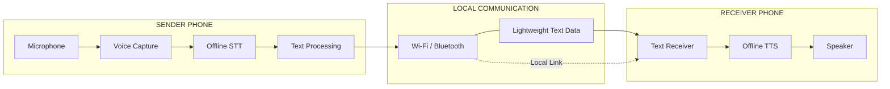

<div align="center">
  
# iTantra

**Offline speech relay for low-bitrate & no-network scenarios — in 10 Indian languages.**

No internet. No cloud APIs. Speak in your language on one phone, it's heard aloud on the other — works like a walkie-talkie, relayed over WiFi Direct or Bluetooth.


<br>

<table>
<tr>
<td align="center" width="180"><h3>10</h3>Indian languages targeted</td>
<td align="center" width="180"><h3>No</h3>Need Internet?</td>
<td align="center" width="180"><h3>0</h3>Cloud API calls for speech</td>
<td align="center" width="180"><h3>SIH 2026</h3>PS #26173, ISRO</td>
</tr>
</table>
</div>


## Contents

- [Demo](#demo)
- [Why iTantra?](#why-itantra)
- [What iTantra Does](#what-itantra-does)
- [Key Features](#key-features)
- [How It Works](#how-it-works)
- [System Architecture](#system-architecture)
- [Technology Stack](#technology-stack)
- [Language Support](#language-support)
- [Project Status](#project-status)
- [Getting Started](#getting-started)
- [Project Structure](#project-structure)
- [Team](#team--debug-or-die)
- [Contributing](#contributing)
- [License](#license)

## Why iTantra?

During a disaster — an earthquake, a flood, a cyclone — the network is usually one of the first things to fail. Cell towers get damaged or lose power, the internet goes down with them, and suddenly there's no way to make a call, send a text, or reach anyone outside the immediate area. This is exactly the moment people most need to communicate — to ask for help, to tell someone where they are, to know if their family is safe — and it's exactly when they can't.

- **Towers go down with the storm itself.** When Cyclone Fani hit Odisha in 2019, hundreds of cell towers were damaged, cutting off cellular and internet connectivity across cities including Puri, Khordha, and Bhubaneswar for days.
- **Even surviving networks can collapse under load.** When a disaster hits, huge numbers of people try to call or message at once, and cellular networks weren't built to handle that surge — calls drop and messages queue for hours.
- **Power failure finishes what the storm started.** Cell towers typically run on batteries with only a few hours of backup; once that runs out and the grid stays down, coverage disappears even in areas the disaster didn't directly damage.
- The result is the same story after almost every major disaster: rescue teams and affected communities lose the ability to reach each other at the exact moment it matters most, sometimes for days at a stretch.

No cell tower can be rebuilt in an hour, and no power grid comes back overnight. So here's where **iTantra** comes in — built on the assumption that none of that infrastructure is coming back anytime soon, and that two phones need a way to talk to each other anyway.


## What iTantra Does

Instead of trying to move audio — which is heavy, slow, and needs a good connection — iTantra moves the *sentence*. Speech is converted to text right there on the sending phone, that text (a few hundred bytes, not megabytes) travels straight to a second phone over WiFi or Bluetooth, and the receiving phone turns it back into spoken audio. No towers, no router, no data plan, and nothing resembling a server anywhere in the loop.

- **Hold to talk, release to send.** Push-to-talk turns the pair of phones into a walkie-talkie — speak, let go, and the sentence is transcribed, relayed, and spoken aloud on the other end within moments.
- **Flip it off, get a normal phone back.** The same device switches out of relay mode instantly, no separate app or reboot needed.
- **One pipeline, ten languages.** The person speaking and the person listening don't even need to understand the same language — the loop handles the translation between them.
- **Everything stays on the two phones.** No cloud call, no internet check, no external service touched at any point from the moment someone starts speaking to the moment the other phone plays it back.

Take away the towers, the routers, the entire internet — and two phones can still find a way to talk. That's the whole idea.

## Key Features

| | |
|---|---|
| **Offline speech pipeline** | On-device STT via [Vosk](https://alphacephei.com/vosk/) (open-source, offline), and on-device TTS — zero network calls, ever. |
| **Sentence-boundary detection** | Vosk's built-in endpointing marks the end of a spoken sentence, triggering transmission the moment the speaker stops — no manual "done" button needed. |
| **Direct phone-to-phone transport** | [Google Nearby Connections](https://developers.google.com/nearby/connections/overview) negotiates WiFi and Bluetooth automatically between the two devices — no tower, router, or internet involved. |
| **Push-to-talk relay** | Hold to speak, release to send — the sentence is transcribed and relayed to the other phone within moments of finishing. |
| **Dual-mode operation** | A toggle switches the same device between walkie-talkie relay mode and normal phone behavior, instantly. |
| **Multilingual by design** | One shared pipeline architecture, built so each of the 10 required Indian languages is a model-file swap rather than a separate codebase. |
| **Low/mid-range hardware target** | Built and benchmarked against phones in the low-to-mid range, not flagship-only devices. |
| **Open-source, always** | No proprietary or cloud-hosted voice SDK anywhere in the stack — every model and library used is listed in `Credits`. |


## How It Works



## System Architecture

```mermaid
flowchart LR

    subgraph S["SENDER DEVICE"]
        direction TB

        A["Microphone"]
        B["Voice Capture"]
        C["Offline STT"]
        D["Text Processing"]

        A --> B
        B --> C
        C --> D
    end

    subgraph L["LOCAL COMMUNICATION"]
        direction TB

        E["Wi-Fi / Bluetooth"]
        F["Lightweight Text Data"]

        E --- F
    end

    subgraph R["RECEIVER DEVICE"]
        direction TB

        G["Text Receiver"]
        H["Offline TTS"]
        I["Speaker"]

        G --> H
        H --> I
    end

    D --> E
    F --> G
